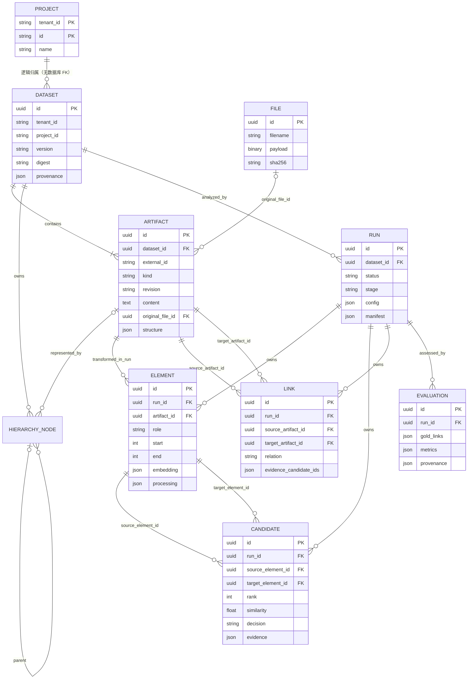

# TLR 技术文档

本文依据当前仓库代码重新分析，不以历史文档作为实现事实。源码位置均相对于 `software-quality-management-backend/`；行号对应本文编写时的当前代码。

## 1. 模块定位

### 1.1 职责

TLR（Traceability Link Recovery）模块从同一软件项目、同一不可变资料快照中选择两组有方向的制品，先把制品正文转换为可检索 Element，再通过向量 Top-K 缩小配对空间，用 LLM 对候选 Element 对作结构化相关性判定，最后把正向 Element 对聚合为 Artifact 级 `related_to` 链接。运行数据、阶段状态、证据和评测结果均持久化。

模块还包含直接服务质量工作台的外围产品能力：项目目录、原始文件保存与下载、文件正文抽取、资料快照继承、生命周期分层、批量 Run 规划、结果可视化查询和候选证据详情。这些能力不是 LiSSA 论文算法本身，而是本项目围绕 TLR 增加的输入管理、运行管理与结果消费能力（`app/modules/tlr/catalog.py:1-44`、`app/modules/tlr/planning.py:1-12`）。

### 1.2 输入、处理和输出

| 阶段 | 当前实现接受或产生的数据 |
|---|---|
| 输入 | `tenant_id`、`project_id`、快照版本和来源；每个 Artifact 的 `external_id`、业务类型、修订号、正文、定位信息及可选结构元数据；Run 的源/目标 ID 集合与运行选项（`app/modules/tlr/schemas.py:13-54`、`app/modules/tlr/schemas.py:71-86`） |
| 处理 | 类型化预处理、Embedding、余弦 Top-K、逐候选 LLM 判定、任一正向 Element 对聚合、可选金标准评测（`app/modules/tlr/service.py:170-307`、`app/modules/tlr/service.py:349-394`） |
| 输出 | Run 状态与可复现 manifest、Element、Candidate、Artifact 级 Link、Evaluation；工作台另取得可视化图数据和候选原文证据（`app/modules/tlr/router.py:88-124`、`app/modules/tlr/catalog.py:407-458`） |

### 1.3 能力边界

- `Link.relation` 当前固定为泛化的 `related_to`，没有实现 `satisfies`、`implements`、`verifies` 等关系分类（`app/modules/tlr/models.py:97-107`）。
- 链接表示模型认为制品相关，不证明需求已正确实现、软件实际可运行、测试已经执行或测试覆盖充分；分类提示也显式禁止作这些推断（`app/modules/tlr/pipeline.py:14-20`）。
- Evaluation 只比较有方向的 Artifact ID 对，计算 precision、recall、F1 和 candidate recall；金标准不进入检索或判定输入（`app/modules/tlr/service.py:349-389`）。
- 上传接口只抽取文本、代码、PDF 和 DOCX 正文；扫描 PDF 不做 OCR，任意二进制、压缩工程包和通用建模格式没有自动解析（`app/modules/tlr/uploads.py:72-112`）。
- `architecture_model` 只接受具有 `components`/`interfaces` 数组的约定 JSON；不是通用 UML、EMF 或 XMI 适配器（`app/modules/tlr/preprocessing.py:196-234`）。
- 代码结构切分只专门支持 Python 和 Java。自动模式解析失败时退回字符块；显式选择 `method`/`class` 时失败即终止（`app/modules/tlr/preprocessing.py:47-98`、`app/modules/tlr/preprocessing.py:166-195`）。
- Run 是同步 HTTP 执行，没有任务队列、恢复点重启或原 Run 重试。状态只能从 `pending` 原子领取一次；失败后须创建新 Run（`app/modules/tlr/service.py:121-168`）。
- 当前作用域隔离依赖请求提供 `tenant_id`、`project_id` 并在查询中匹配，不等同于身份认证或授权系统（`app/modules/tlr/repository.py:12-27`）。

## 2. 依赖关系

### 2.1 项目内部依赖

TLR 路由在 `/api/v1` 总路由中注册。核心路由、资料目录路由和分层规划路由共享 `TlrService`；服务通过 `TlrRepository` 访问 SQLAlchemy 模型，通过注入的 Embedding/LLM Provider 调用外部模型（`app/api/v1/router.py:3-16`、`app/modules/tlr/router.py:31-44`）。

`app/models/__init__.py:1-5` 导入 TLR ORM，使 Alembic 能发现这些表。模型配置模块不是 TLR 子包，但执行 Run 时由 `resolve_tlr_models()` 查询租户级任务绑定，覆盖环境变量创建的默认 Provider（`app/modules/tlr/service.py:13`、`app/modules/model_config/runtime.py:14-74`）。

旧 RAG 的 `documents/chunks/knowledge_bases`、`PgVectorStore` 和 `RagService` 与 TLR 是并列能力。TLR 不使用旧 `chunks` 表或 pgvector 检索，而是把向量作为 JSON 保存在 `tlr_elements.embedding`，在当前 Run 中交给 Python 或 Java 检索器（`app/modules/tlr/models.py:64-82`、`app/modules/tlr/service.py:224-265`）。

### 2.2 关键第三方依赖

| 依赖 | TLR 中的实际用途 |
|---|---|
| FastAPI、python-multipart | JSON API、查询参数和 multipart 文件上传 |
| Pydantic | Dataset、Run、Decision、Evaluation 等严格契约，未知字段禁止 |
| SQLAlchemy Async、Alembic | 状态和全部中间/结果实体持久化及迁移 |
| httpx | OpenAI-compatible Embedding/LLM Provider 和 CLI HTTP 调用 |
| pypdf、python-docx | PDF/DOCX 正文抽取；DOCX 同时保留段落和表格顺序 |
| tree-sitter、tree-sitter-java | Java 类、接口、方法和构造器边界解析 |
| cryptography/Fernet | 数据库模型连接中的 API key 加密，不参与 TLR 算法 |
| aiosqlite（dev） | 本地和测试 TLR SQLite；生产默认配置仍为 PostgreSQL |

依赖声明见 `pyproject.toml:10-35`。

### 2.3 Provider 与模型解析

默认依赖注入只构造 `OpenAICompatibleEmbeddingProvider` 和 `OpenAICompatibleLLMProvider`（`app/api/dependencies.py:33-52`）。执行每个 Run 前，`resolve_tlr_models()` 按租户读取三个逻辑任务：

1. `tlr_embedding`：生成 Element 向量；
2. `tlr_classification`：判定候选 Element 对；
3. `architecture_extraction`：仅供 `llm_structure` 预处理，未绑定时回退到分类 LLM。

数据库绑定优先于 `.env`；选定的 endpoint、模型、维度和来源快照写入 Run manifest，但密钥不写入 manifest（`app/modules/model_config/runtime.py:30-74`、`app/modules/tlr/service.py:182-197`）。Provider 当前只有 OpenAI-compatible 实现，不存在独立 Ollama SDK、DeepSeek SDK 或厂商专用调用路径。

### 2.4 LiSSA、Python/Java retrieval backend 与运行环境

本项目固定记录 LiSSA V2 上游提交 `a8e652f29bbdcc4bdcd3d98cd85aa4a37cb65480`。`vendor/lissa/` 保存上游源码；`integrations/lissa/dependency.json:1-10` 声明来源、Java 21、Maven 坐标和复用边界。

两种 backend 只替换 Retrieval 这一步：

| backend | 实际实现 | 运行依赖 |
|---|---|---|
| `python`（默认） | Python 内存中归一化向量、计算余弦相似度、每个源 Element 取 Top-K；同分按目标输入顺序稳定排序（`app/modules/tlr/pipeline.py:65-85`） | Python 3.11+ 和 Embedding 服务；不需要 Java、LiSSA JAR 或 pgvector |
| `lissa` | Python 把已生成的向量经 stdin JSON 交给 Java bridge；bridge 用原版 `ElementStore.setup()` 和 `findSimilarWithDistances()` 检索，再经 stdout JSON 返回（`app/modules/tlr/pipeline.py:88-155`、`integrations/lissa/LissaRetrievalBridge.java:10-38`） | Java 21；构建时还需 Maven；固定 LiSSA fat JAR 和已编译 bridge class |

Java backend 不调用 LiSSA 的数据集加载、预处理、Embedding、Prompting、Aggregation 或 Evaluation。`scripts/build_lissa.ps1` 构建上游 JAR 并编译桥接；运行时会校验文件存在、输出完整性和相似度范围，并把 JAR/class SHA-256 写入 manifest。

因此应区分：LiSSA/论文给出通用 RAG-TLR 方法和原版 ElementStore；当前项目实际复用的是可选检索器；其余执行管线及产品外围能力均是本项目适配。

## 3. 内部架构

### 3.1 组件职责

| 组件 | 真实职责 | 主要上游/下游 |
|---|---|---|
| `router.py` | Dataset、Artifact、Run、Result、Evaluation 核心 API；组装 `TlrService` | FastAPI → Service/Repository |
| `catalog.py` | 项目浏览、上传、快照继承、原文件下载、可视化和证据详情 | 前端 → Uploads/Service/ORM |
| `planning.py` | kind/显式 structure 到生命周期层的映射；生成一组独立有向 Run | 前端/CLI → Service.create_run |
| `schemas.py` | 严格输入输出模型、数量和字段校验、Run 选项 | Router/Service/Importer |
| `models.py` | TLR 领域表，其中 `TlrHierarchyNode` 独立持久化数据集层级；另把模型配置表纳入本地 TLR 初始化表集合 | Service/Repository/Alembic |
| `service.py` | 快照导入、Run 创建/领取、模型解析、全管线编排、失败固化、评测 | Router/Planning → Pipeline/Preprocessing/ORM |
| `repository.py` | Dataset/Run 的租户项目作用域查询、Artifact 加载、结果分页 | Router/Service → SQLAlchemy |
| `uploads.py` | 上传格式白名单、大小限制、正文抽取；不推断业务类型 | Catalog → ArtifactInput |
| `importers.py` | TraceLab internal/external XML 与无表头 gold CSV 适配 | 数据准备脚本 → Schema |
| `preprocessing.py` | 根据类型和选项把 Artifact 转为带字符区间与处理元数据的 Element | Service → Element ORM/架构 LLM |
| `pipeline.py` | 向量校验、Python/LiSSA 检索、严格 PairClassifier | Service → Provider/Java bridge |
| `diagnostics.py` | 执行前配置检查和面向用户的脱敏失败分类 | Service → API 错误 |
| `visualization.py` | 根据前端折叠状态投影真实 Link 端点并聚合同端点边；只生成视图，不写 Candidate/Link | Catalog → 前端 |

### 3.2 组件架构图

```mermaid
flowchart LR
    UI[质量工作台前端] --> API[/api/v1/tlr]
    CLI[run_tlr / run_tlr_plan] --> API
    CODE[内部 Python 调用] --> SVC[TlrService]

    API --> CORE[router.py]
    API --> CAT[catalog.py]
    API --> PLAN[planning.py]
    CORE --> SVC
    CAT --> UP[uploads.py]
    CAT --> SVC
    PLAN --> SVC

    SVC --> REPO[TlrRepository]
    SVC --> PRE[preprocessing.py]
    SVC --> PIPE[pipeline.py]
    SVC --> RESOLVE[model_config.runtime]
    REPO --> DB[(TLR tables)]
    PRE --> DB
    PRE -. llm_structure .-> LLM[LLM Provider]
    RESOLVE --> EMB[Embedding Provider]
    RESOLVE --> LLM
    PIPE --> PY[Python cosine Top-K]
    PIPE --> BRIDGE[Java bridge]
    BRIDGE --> LISSA[LiSSA ElementStore]
    SVC --> DB
```

关键调用链为：`app/main.py:27` → `app/api/v1/router.py:13-16` → TLR routers → `TlrService` → `preprocess_typed`/Provider/Retriever/`PairClassifier` → ORM commit。

## 4. 一次 Run 的完整执行流程

### 4.1 Artifact 进入不可变 Dataset

结构化 JSON 由 `POST /datasets` 直接校验为 `DatasetInput`；文件上传则先由 `extract_text()` 提取正文，再组装相同的 `DatasetInput`。输入可显式给出 `hierarchy[]`：每个节点有稳定 `node_key`、可选 `parent_key` 和可选 `artifact_external_id`。不关联 Artifact 的节点是纯结构节点；关联 Artifact 的节点仍可拥有任意子节点。服务校验引用与环后，将层级作为 Dataset 快照的一部分写入数据库。为兼容旧输入，未给 `hierarchy` 时只在导入时把 Artifact `structure.parent_ids` 转成持久化节点，不由前端临时推断（`app/modules/tlr/schemas.py`、`app/modules/tlr/service.py`）。

纯结构节点不含正文，也没有进入 Run 的 external ID，因此不可能生成 Element、Embedding、Candidate、LLM 判定或 Link。旧 SAFA `package`/`reference_only` 记录迁移为不关联 Artifact 的结构节点；Run 创建阶段也显式排除这类旧 Artifact。新版本总是新 Dataset，不覆盖旧快照。

上传路径额外保存 `TlrFile.payload` 原始字节，并令 Artifact 的 `original_file_id` 指向它。基于 `base_dataset_id` 上传时，旧 Artifact 内容先复制到新 Dataset；同 external ID 只有显式 `replace_existing=true` 才用新文件替换，但旧 Dataset 与旧 File 保留（`app/modules/tlr/catalog.py:309-403`）。

### 4.2 创建和领取 Run

`create_run()` 验证 Dataset 属于给定 tenant/project、源目标 ID 均存在且两集合不重复不相交，然后保存 `pending/created` Run。`config` 保存完整 RunInput，初始 manifest 保存 schema version 和 dataset digest（`app/modules/tlr/schemas.py:71-86`、`app/modules/tlr/service.py:100-119`）。

`execute()` 使用带 `status='pending'` 条件的 SQL UPDATE 原子领取任务，成功后置为 `running/preprocessing`，防止多个 worker 重复执行。随后解析模型任务绑定、检查必要密钥，并由环境级总超时包围整个管线（`app/modules/tlr/service.py:121-144`）。

### 4.3 Artifact → Element 预处理

服务按 `source_ids`、`target_ids` 选择 Artifact，调用 `preprocess_typed()`，为每个处理单元保存角色、类型、序号、原文字符区间 `[start,end)`、正文 hash 与处理元数据（`app/modules/tlr/service.py:199-223`、`app/modules/tlr/preprocessing.py:129-163`）。

`auto` 策略的真实映射如下（`app/modules/tlr/preprocessing.py:31-44`）：

- `code`/`test_code`：Java/Python 用 `method`，其他语言用 `chunk`；
- `architecture_model`：`model_features`；
- `test_case`：整件 `artifact`，避免拆散前置条件、步骤和预期结果；
- `requirement`、`hazard`、`natural_language`：`sentence`；
- 其他类型：`sections`。

还可显式选择 `artifact`、`chunk`、`sentence`、`method`、`class`、`sections`、`model_features` 或 `llm_structure`。`llm_structure` 分块调用 architecture LLM，只接受带有原文精确引文的 component/interface/operation/dependency；派生信息和模型/提示 hash 写入 `processing`（`app/modules/tlr/preprocessing.py:166-278`）。

每处理完一个 Artifact 就提交 Element，随后检查全局 Element、候选理论数和全量比较数上限。因此失败可能保留已经提交的前序 Element（`app/modules/tlr/service.py:201-223`）。

### 4.4 Embedding 与缓存

Run 进入 `embedding` 阶段。服务先在同 tenant、同 project 的历史 Run 中查找相同 `external_id + content sha256` 且 endpoint/model 相同的非空向量；命中则复用，否则每 32 个 Element 调用一次 Embedding Provider。每批校验返回数量、统一维度、有限值和非零向量后写入 `tlr_elements.embedding` 并提交（`app/modules/tlr/service.py:224-252`、`app/modules/tlr/service.py:309-347`、`app/modules/tlr/pipeline.py:51-62`）。

缓存实现的实际查询范围同时限制 tenant 和 project，虽然 manifest 中的文字 key 简写了 project；不同 project 不复用。Embedding 维度和复用/新编码数量进入 manifest。

### 4.5 Top-K Retrieval → Candidate

Run 进入 `retrieval`。`retrieval_backend=python` 时直接对已持久化向量计算余弦相似度；`lissa` 时通过无 shell 的 Java 子进程调用桥接。两者均为每个 source Element 返回最多 `min(top_k, target_count)` 个 target Element，形成有方向的 Candidate，保存 rank、similarity，初始 decision 为 `pending`（`app/modules/tlr/service.py:253-268`）。

相似度只是向量相似度，不是链接概率；未进入 Top-K 的 Artifact 对也不能据此判为不相关。

### 4.6 Candidate → LLM 判定

Run 进入 `classification`。每个 Candidate 依次把 source/target Element 的 `kind` 和正文交给分类 LLM，温度固定为 0。响应必须通过 `Decision` 严格校验；正向结果必须含双方非空引文，所有非空引文必须确实为对应 Element 正文子串。通过后 decision 写为 `related` 或 `unrelated`，证据 JSON 与累计 classified 数逐条提交（`app/modules/tlr/pipeline.py:164-187`、`app/modules/tlr/service.py:269-285`）。

若响应格式、引文或单次 Provider 调用无效，当前 Candidate 保存失败证据并保持 `pending`，随后继续处理其他 Candidate；系统不会把失败候选伪装成负例。连续失败达到 `max_consecutive_failures` 才触发保护并跳过后续节点。预处理和 Embedding 也按 Artifact/Element 记录 `manifest.node_failures`；批量 Embedding 失败会退回逐 Element 调用。只要仍有可用数据，Run 以 `completed/completed_with_errors` 保存部分结果。

### 4.7 Link Aggregation 和完成

分类阶段结束后进入 `aggregation`。服务只收集成功判定为 `related` 的 Candidate，按 `(source_artifact_id,target_artifact_id)` 分组；任一子 Element 对为正，就创建一个 Artifact 级 `related_to` Link，并在 `evidence_candidate_ids` 保存所有支持该链接的 Candidate ID。未判定失败节点不参与聚合，也不会阻止其他成功 Link 持久化。

无法继续的全局错误（配置缺失、没有可用 source/target Element、检索后端整体失败、超时等）仍会将 Run 标为 `failed`；可局部隔离的节点错误则形成部分完成结果。

### 4.8 Evaluation

Evaluation 是完成后的独立 API，不属于生成管线。它先验证所有 gold pair 都在本 Run 的源/目标选择范围内，去重后比较预测 Artifact 对与 gold：

- `precision = TP / predicted`；
- `recall = TP / gold`；
- `F1 = 2TP / (2TP + FP + FN)`；
- `candidate_recall = retrieved_gold / gold`，其中 retrieved 表示至少有 Element 对进入过候选集。

分母为零时记 0。原始去重 gold、指标及 provenance 保存为新 Evaluation；同一 Run 可保存多次评测（`app/modules/tlr/service.py:349-394`）。

## 5. 数据模型

### 5.1 实体含义与生命周期

| 实体 | 生命周期与保存内容 |
|---|---|
| Project | tenant 内的产品工作区；复合主键 `(tenant_id,id)`，保存名称、说明和创建时间。上传要求先创建；结构化 Dataset API 可自动创建同名项目 |
| File | 一次上传的原始文件字节、原文件名、媒体类型、SHA-256；只由上传路径产生，结构化 Artifact 可以没有 File |
| Dataset | 项目某一不可变资料快照；保存 tenant/project、版本、整个输入摘要、来源和创建时间 |
| Artifact | Dataset 中的制品；同一 Dataset 内 external ID 唯一，保存业务类型、修订、locator、完整抽取正文、正文 hash、structure，并可指向原 File |
| HierarchyNode | Dataset 中持久化的树节点；保存父节点、顺序、类型、标题和来源元数据。`artifact_id=NULL` 是纯结构节点；非空时关联真实 Artifact。两类节点都可以有子节点 |
| Run | 针对一个 Dataset 的一次有向分析；保存源/目标选择与选项、状态/阶段、模型和算法 manifest、计数、错误与时间。创建后不修改配置，不可再次领取 |
| Element | 某 Run 中由 Artifact 派生的处理单元；保存 source/target 角色、区间、正文、hash、JSON 向量和预处理 provenance。它属于 Run，不是跨 Run 的全局切片 |
| Candidate | 一个 Run 内 source Element 到 target Element 的 Top-K 候选；保存排名、相似度、三态 decision 和结构化证据 |
| Link | Candidate 正向判定聚合出的 Artifact 级有向链接；保存支持它的 Candidate ID 列表 |
| Evaluation | 对已完成 Run 的一次外部金标准评测；保存 gold、指标和来源，不反向影响 Run |

模型定义见 `app/modules/tlr/models.py:22-124`。数据库外键定义实体从属关系，但 Dataset 的 tenant/project 字段与 Project 之间目前是应用层逻辑关系，不是数据库外键；File 也只通过 Artifact 被间接纳入项目范围。

### 5.2 ER 图



迁移链为基础 RAG 表 → 初版 TLR 七表 → Project/File → Artifact/Element structure 扩展 → 模型配置表 → Dataset 层级节点表（`migrations/versions/20260906_0006_tlr_hierarchy.py`）。

## 6. 项目中的实际使用方式

### 6.1 前端文件上传与运行

`software-quality-agent/frontend/src/quality/` 是当前真实调用 TLR API 的前端：

1. 通过 `/capabilities` 取得格式、类型和上限；通过 `/projects` 创建/浏览项目；
2. 用户为每个本地文件明确填写 external ID、kind、revision，前端以 multipart 调用 `/projects/{project_id}/upload`；后端不自动猜业务类型（`../software-quality-agent/frontend/src/quality/Dialogs.tsx:31-51`）；
3. 前端可手选 source/target 创建单 Run，或按生命周期层创建 plan；随后逐 Run 调用 `/execute`（`../software-quality-agent/frontend/src/quality/Dialogs.tsx:56-70`、`../software-quality-agent/frontend/src/quality/Workspace.tsx:29-33`）；
4. 结果页调用 visualization、candidate detail 和 Artifact detail，展示关系图、矩阵、候选判定及原文证据；JSON 导出发生在浏览器端（`../software-quality-agent/frontend/src/quality/Results.tsx:35-71`）。

关系图的基础数据始终是完整持久化层级和真实 Artifact Links。前端只保存左右两侧各自的折叠节点 ID，并把状态提交给 projection API。后端对每条真实 Link 分别寻找 source/target 当前可见的自身或最近祖先；相同可见端点对合并为一条投影边，返回 `count`、`underlying_link_ids` 和完整底层 Links。节点的后代 Artifact 数与相关 Link 数也在本次响应中派生，不持久化。展开节点后重新投影即可恢复真实 Artifact 端点。该逻辑位于 `visualization.py`，不会修改 TLR pipeline、Candidate、Link 或 Evaluation。

### 6.2 已有结构化 Artifact

程序或外部数据转换器可直接 `POST /api/v1/tlr/datasets` 提交 `DatasetInput`，不保存原始 File，只保存 Artifact 正文和元数据。然后 `POST /runs`、`POST /runs/{id}/execute`，最后查询 outputs 或提交 evaluation。这是测试和 `run_tlr.py` 使用的核心路径（`app/modules/tlr/router.py:47-124`、`tests/test_tlr.py:115-171`）。

TraceLab XML 并不是公开上传接口自动识别的特殊协议；它由 `scripts/prepare_smos.py` 调用 `importers.read_collection()` 转成结构化 Dataset JSON。external 模式只允许读取 XML 所在目录内的 UTF-8 文件，阻止路径越界（`app/modules/tlr/importers.py:11-54`）。

### 6.3 命令行脚本

- `prepare_smos.py`：把 vendor 中 SMOS 的需求 XML、代码 XML 和无表头 answer.csv 转为 dataset/run/gold JSON。
- `prepare_safa.py`：把 SAFA/Dronology 数据转换为 DatasetInput 兼容 JSON。
- `run_tlr.py`：通过 HTTP 导入 Dataset、创建并执行一个 Run，可选提交 gold，最后分页导出 Run/Dataset/Elements/Candidates/Links/Evaluations。
- `run_tlr_plan.py`：读取已有 dataset 描述或 ID，创建层间 plan，可选顺序执行各 Run 并导出结果。
- `fetch_lissa.py`、`build_lissa.ps1`：只有选择 Java backend 时用于取得固定上游和构建运行物。
- `init_local_tlr.py`：显式创建只含 TLR 依赖图及模型配置表的 SQLite 数据库与本地环境文件；旧 RAG 的 pgvector 能力不在其中。
- `upgrade_local_tlr.py`：针对现有 SQLite TLR 数据库补齐当前结构；它不是 Alembic 的替代生产迁移流程。
- `audit_tlr_preprocessing.py`：对类型化预处理作针对性样本审查，不执行完整 Run。

脚本入口与参数见 `scripts/run_tlr.py:14-24`、`scripts/run_tlr_plan.py:10-19`、`scripts/prepare_smos.py:15-44`、`scripts/prepare_safa.py:137-143`。

### 6.4 项目内部 Python 调用

内部代码可以构造 `TlrService(session, embedding, llm, settings)`，依次调用 `import_dataset()`、`create_run()`、`execute()` 和 `evaluate()`；分层规划也正是直接调用 `create_run(commit=False)` 后原子提交一组 Run（`app/modules/tlr/planning.py:104-146`）。

需要注意，直接调用 Service 会绕过 HTTP/Pydantic 自动解析之外的外围接口逻辑；调用方仍应使用 `DatasetInput`、`RunInput`、`EvaluationInput`，并自行管理 AsyncSession 和异常边界。

## 7. API

所有路径以下均省略前缀 `/api/v1/tlr`。除创建 Dataset/Project 的 JSON 体已经包含作用域外，大多数查询和执行接口要求 query 参数 `tenant_id`、`project_id`。成功响应通常封装为 `{"code":0,"message":"success","data":...}`（`app/schemas/common.py:6-13`）。

### 7.1 Project / File

| 方法与路径 | 核心用途 | 关键输入 | 核心输出 |
|---|---|---|---|
| `GET /capabilities` | 前端初始化上传能力 | 无 | kind、扩展名、单文件/批次上限、环境密钥是否配置 |
| `POST /projects` | 建立 tenant 内项目 | `tenant_id, project_id, name, description` | 项目摘要 |
| `GET /projects` | 分页列项目 | `tenant_id, offset, limit` | 项目及 Dataset/Run 数量 |
| `GET /projects/{project_id}` | 项目详情 | 作用域 query | 项目摘要 |
| `GET /projects/{project_id}/datasets` | 项目快照历史 | 作用域 query、分页 | DatasetView 页 |
| `GET /projects/{project_id}/runs` | 项目 Run 历史 | 作用域 query、分页 | RunView 页 |
| `POST /projects/{project_id}/upload` | 保存原文件、抽取正文并创建新快照 | multipart：tenant、version、metadata、files；可选 base/replace | 新 DatasetView |
| `GET /artifacts/{artifact_id}/download` | 下载原始上传文件；无 File 时回退为 UTF-8 正文 | 作用域 query | 二进制响应 |

项目接口见 `app/modules/tlr/catalog.py:74-227`，上传与下载见 `app/modules/tlr/catalog.py:270-403`。

### 7.2 Dataset / Artifact

| 方法与路径 | 核心用途 | 关键输入 | 核心输出 |
|---|---|---|---|
| `POST /datasets` | 导入已抽取的结构化 Artifact 快照 | DatasetInput JSON | DatasetView |
| `GET /datasets/{dataset_id}` | 取得快照元数据 | 作用域 query | DatasetView |
| `GET /datasets/{dataset_id}/artifacts` | 取得完整 Artifact（含正文） | 作用域 query、分页 | ArtifactView 页 |
| `GET /datasets/{dataset_id}/inventory` | 工作台轻量清单，不返回完整正文 | 作用域 query、分页 | 标识、类型、locator、hash、字符数、structure 等 |
| `GET /datasets/{dataset_id}/hierarchy` | 读取数据集持久化的完整层级 | 作用域 query | 结构节点与 Artifact 关联、父节点、顺序和元数据 |
| `GET /artifacts/{artifact_id}` | 单制品完整详情 | 作用域 query | ArtifactView |
| `GET /datasets/{dataset_id}/layers` | 按 structure/kind 计算生命周期分层 | 作用域 query | 各层 Artifact ID、默认相邻非空层对、排除项 |

核心接口见 `app/modules/tlr/router.py:47-73`，目录和分层接口见 `app/modules/tlr/catalog.py:229-290`、`app/modules/tlr/planning.py:98-101`。

### 7.3 Run / Plan

| 方法与路径 | 核心用途 | 关键输入 | 核心输出 |
|---|---|---|---|
| `POST /runs` | 创建一个独立有向 Run | Dataset、source/target IDs、RunOptions；可带 plan_id/layer_pair | `pending` RunView |
| `POST /plans` | 将选定层对批量展开为独立 Run | Dataset、可选 pairs、共享 RunOptions | plan_id、RunView 列表、排除项 |
| `POST /runs/{run_id}/execute` | 原子领取并同步执行 Run | 作用域 query | 完成或失败后的 RunView/错误响应 |
| `GET /runs/{run_id}` | 查询状态、阶段、manifest 和计数 | 作用域 query | RunView |

实现见 `app/modules/tlr/router.py:76-93`、`app/modules/tlr/planning.py:104-146`。

### 7.4 Result

| 方法与路径 | 核心用途 | 关键输入 | 核心输出 |
|---|---|---|---|
| `GET /runs/{run_id}/outputs/{kind}` | 分页读取持久化结果 | kind=`elements/candidates/links/evaluations`、作用域、分页 | 对应结果页 |
| `GET /runs/{run_id}/visualization` | 取得真实结果、完整层级和默认全展开投影 | 作用域 query | Elements、Candidates、真实 Links、Hierarchy、Projection、失败节点 |
| `POST /runs/{run_id}/visualization/projection` | 根据两侧折叠状态重算可见图，不改数据库 | `collapsed_source[]`、`collapsed_target[]` | 同上；Projection 为端点提升和聚合后的视图 |
| `GET /runs/{run_id}/candidates/{candidate_id}` | 查看一个候选及双方 Element 原文证据 | 作用域 query | Candidate、source Element、target Element |

实现见 `app/modules/tlr/router.py:95-113`、`app/modules/tlr/catalog.py:407-458`。

### 7.5 Evaluation

| 方法与路径 | 核心用途 | 关键输入 | 核心输出 |
|---|---|---|---|
| `POST /runs/{run_id}/evaluations` | 对已完成 Run 提交外部金标准 | `gold_links[{source_id,target_id}]`、provenance、作用域 query | EvaluationView（指标和来源） |

`EvaluationView` 不返回已保存的 gold_links；若需读取数据库中的完整 Evaluation，目前通用 outputs schema 同样只暴露 id/run_id/metrics/provenance（`app/modules/tlr/schemas.py:136-147`）。

## 8. 配置

### 8.1 环境级配置

环境配置由 Pydantic Settings 从 `.env` 和进程环境读取（`app/core/config.py:7-13`）。真正影响 TLR 的配置如下：

| 配置 | 默认值 | 作用 |
|---|---:|---|
| `DATABASE_URL` | PostgreSQL URL | 全部 TLR 持久化；本地脚本可显式切 SQLite |
| `MODEL_BASE_URL/API_KEY` | OpenAI URL/空 | 未绑定数据库任务时的 Embedding endpoint/密钥 |
| `EMBEDDING_MODEL` | `text-embedding-3-small` | 默认 Embedding 模型 |
| `EMBEDDING_DIMENSION` | `1536` | Provider 预期维度和数据库绑定缺省维度 |
| `MODEL_TIMEOUT_SECONDS` | `30` | 单次 Embedding 请求超时 |
| `LLM_PROVIDER` | `openai_compatible` | 当前只允许此值 |
| `LLM_BASE_URL/API_KEY/MODEL` | DeepSeek URL/空/`deepseek-chat` | 未绑定数据库任务时的分类与架构 LLM |
| `LLM_TIMEOUT_SECONDS` | `60` | 单次 LLM 请求超时 |
| `MODEL_CONFIG_ENCRYPTION_KEY` / `MODEL_CONFIG_KEY_FILE` | 空 / `data/.model-config.key` | 数据库模型连接密钥的 Fernet key 来源 |
| `TLR_RUN_TIMEOUT_SECONDS` | `1800` | 整个 `_pipeline` 总超时 |
| `TLR_MAX_ELEMENTS` | `5000` | 单 Run Element 上限 |
| `TLR_MAX_CANDIDATES` | `20000` | 预计 Candidate 上限 |
| `TLR_MAX_COMPARISONS` | `2000000` | source×target Element 全比较上限 |
| `TLR_RETRIEVAL_TIMEOUT_SECONDS` | `120` | Java retrieval 子进程超时 |
| `TLR_LISSA_JAR` | 固定 vendor JAR 路径 | `lissa` backend classpath |
| `TLR_LISSA_BRIDGE_DIR` | `artifacts/lissa/bridge` | bridge class 目录 |
| `TLR_JAVA_COMMAND` | `java` | Java 可执行命令 |

定义见 `app/core/config.py:27-68`。`VECTOR_STORE`、全局 `CHUNK_SIZE/CHUNK_OVERLAP/TOP_K` 和 `RERANK_*` 属于旧 RAG 管线，不被 TLR Service 读取，不应误列为 TLR 配置。

租户可通过 `/api/v1/model-config` 管理连接并绑定 `tlr_embedding`、`tlr_classification`、`architecture_extraction`。这属于持久化的租户级运行环境选择，优先级高于 `.env`；不是 RunInput 的一部分（`app/modules/model_config/schemas.py:8-10`、`app/modules/model_config/runtime.py:21-74`）。

### 8.2 Run 级配置

`RunOptions` 在创建 Run 时固化进 `TlrRun.config`（`app/modules/tlr/schemas.py:42-69`）：

| 字段 | 默认值与限制 | 作用 |
|---|---|---|
| `top_k` | 20，1..100 | 每个 source Element 的目标候选数上限 |
| `source_preprocessor` | `artifact` | 源制品默认预处理策略 |
| `target_preprocessor` | `artifact` | 目标制品默认预处理策略 |
| `kind_preprocessors` | `{}` | 按 kind 覆盖两侧策略 |
| `code_language` | `auto` | 无可靠扩展名时指定 Java/Python |
| `chunk_size` | 2000，100..20000 | `chunk` 及 LLM 结构提取的字符块大小 |
| `max_element_chars` | 30000，100..100000 | 单 Element 最大字符数，不静默截断 |
| `max_consecutive_failures` | 5，1..100 | Provider 连续节点失败的保护阈值；达到后跳过同阶段剩余节点，已成功结果仍保留 |
| `retrieval_backend` | `python` | `python` 或 `lissa`，只改变 Top-K 实现 |

RunInput 另保存 `source_ids`、`target_ids`、可选 `plan_id` 和二项 `layer_pair`。Plan 默认把源/目标预处理改为 `auto`，但手工 `POST /runs` 省略 options 时仍是 `artifact`（`app/modules/tlr/planning.py:85-92`）。分类 prompt、温度 0、聚合规则和 Embedding 批大小 32目前是代码常量，不是可配置项。

### 8.3 Dataset / Input 级配置

Dataset/Input 决定被分析的事实材料，而不改变算法运行环境：

- Dataset：`tenant_id`、`project_id`、`version`、`provenance`；
- Artifact：`external_id`、`kind`、`revision`、`content`、`locator`、`structure`；
- Hierarchy：节点 `node_key`、`parent_key`、可选 `artifact_external_id`、标题、类型、顺序和来源元数据；这是 Dataset 持久化数据，不是前端配置；
- 上传：文件列表及逐文件 metadata、可选 `base_dataset_id`、`replace_existing`；
- structure 可显式给出 `layer`，也可记录 language、content status、父级和关系等 provenance；当前执行会读取 `layer`、`language`、`content_status`，不会自动把任意 structure 关系变成 gold 或 Link（`app/modules/tlr/planning.py:45-57`、`app/modules/tlr/preprocessing.py:22-44`）。

DatasetInput 限单快照最多 5000 个 Artifact、每件正文最多 500000 字符、合计最多 20000000 字符；上传另限单文件 10 MiB、单批最多 50 个文件且总计 50 MiB（`app/modules/tlr/schemas.py:13-36`、`app/modules/tlr/catalog.py:323-352`）。这些是输入契约，不是 Run 级资源限制。

## 9. 实现状态判定

| 分类 | 当前项目中的准确表述 |
|---|---|
| LiSSA/论文能力 | 提供 RAG-TLR 方法基线和 V2 `ElementStore` 实现；论文中的全部预处理、Knowledge 抽象、实验配置和报告性能不能视为本项目已复现 |
| 当前 TLR 核心实现 | 不可变快照、类型化 Element、OpenAI-compatible Embedding、Python 或可选 LiSSA Top-K、严格 LLM 二分类与引文、任一正向聚合、SQL 持久化、外部 gold 评测 |
| 本项目外围产品能力 | Project/File 管理、PDF/DOCX/代码上传、快照继承、生命周期分层与 plan、模型连接/任务绑定、可视化和证据详情、CLI 数据准备与导出 |
| 尚未实现 | 认证授权、后台任务队列与断点恢复、人工复核工作流、细粒度关系类型、OCR、通用工程/模型解析、基于真实执行的功能正确性与测试覆盖结论、论文效果复现承诺 |

关键行为已有测试覆盖：完整持久化与聚合、作用域隔离、Embedding 缓存、失败保留、gold 隔离、迁移一致性、Java/Python 检索对照、上传回滚和快照保留、类型化预处理、分层 plan、模型密钥与任务配置（`tests/test_tlr.py`、`tests/test_tlr_catalog.py`、`tests/test_tlr_layers.py`、`tests/test_model_config.py`）。
